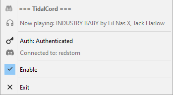
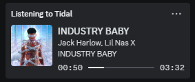

# Tidalcord
Unofficial software to show everyone on Discord you're using the best music service. 
Only works with the Tidal desktop app and on Windows.

If you use the web player, you can use the [Tidal Rich Presence](https://premid.app/store/presences/Tidal) 
presence for [PreMiD](https://premid.app/).

## Screenshots

## Installation process

### 1. Install the application
#### a - Using the installer
1. Download the installer from the [latest release](https://github.com/RedsTom/Tidalcord/releases/latest)
2. Run the installer
3. Launch TidalCord from the start menu

#### b - Manual installation
1. Install Java 23 or higher
2. Download the latest JAR release from the [releases page](https://github.com/RedsTom/Tidalcord/releases/latest)
3. Put it in a folder of your choice
4. Run the JAR file

### 2. Create a Tidal API key
1. When prompted, click on the link to create a Tidal API key
2. Enter a name for your app and click on "Create"
3. Copy the client ID and client secret and paste them in the form
4. Click on "Login"

### 3. Done
You should now see a message confirming that you are logged in.
You can now enjoy TidalCord!

## Contributing
See [CONTRIBUTORS.md](CONTRIBUTORS.md)

## Special thanks
This project was inspired by the code from [purpl3F0x](https://github.com/purpl3F0x/) . Their work helped me understand
how to work with the Tidal client and develop certain features of this project.
